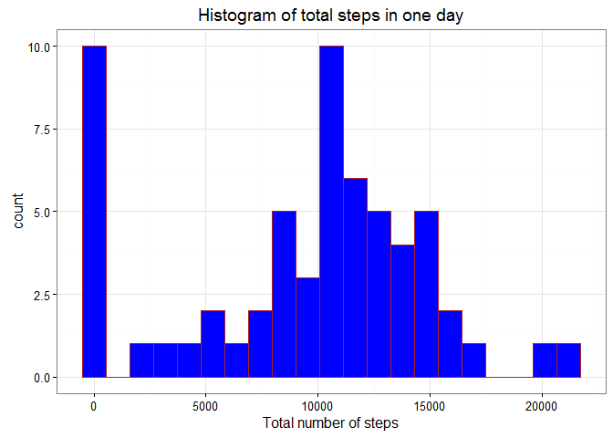
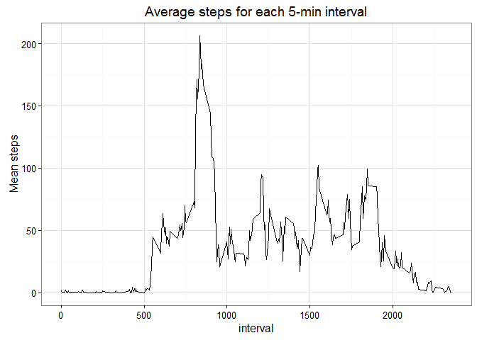
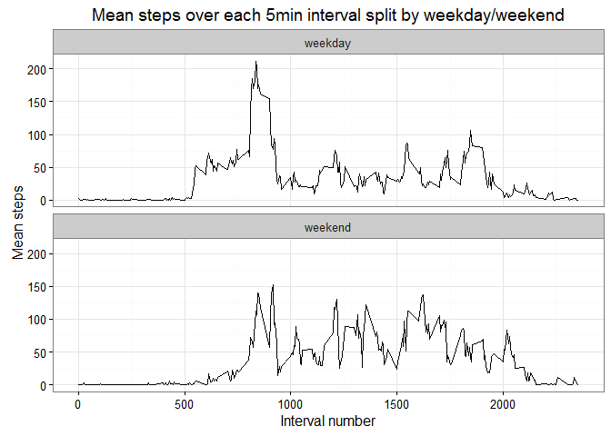

# Reproducible Research: Peer Assessment 1

## Loading and preprocessing the data


```r
library(ggplot2)
library(dplyr)
```

```
## 
## Attaching package: 'dplyr'
```

```
## The following objects are masked from 'package:stats':
## 
##     filter, lag
```

```
## The following objects are masked from 'package:base':
## 
##     intersect, setdiff, setequal, union
```

```r
#read activity.cs file
activity<-read.csv("activity.csv",colClasses=c("integer","Date","integer"))


# get Steps per day grouped by date 
StepsPerDay	<-  activity %>%
  group_by( date ) %>%
  summarise( SumSteps = sum(steps, na.rm=TRUE)) 

# get Steps per day grouped by date 
StepsPerInterval	<-  activity %>%
  group_by( interval ) %>%
  summarise(MeanSteps = mean(steps, na.rm=TRUE)) 

#Plot Histogram of Total Steps in a Day
stepshist<-ggplot( StepsPerDay ,aes(x=SumSteps))+geom_histogram(fill="blue",color="firebrick",binwidth=1060 )+
  xlab("Total number of steps")+
  ggtitle("Histogram of total steps in one day")+
  theme_bw()

#stepshist+scale_fill_gradient(low="blue", high="red")

print(stepshist)  
```



```r
#mean steps per day
meanStepsPerDay<- mean( StepsPerDay$SumSteps, na.rm=TRUE)


#median Steps per Day
medianStepsPerDay <- median( StepsPerDay$SumSteps , na.rm=TRUE)
```

# What is mean total number of steps taken per day?
The mean total number of steps taken per day is 9354.2295082 .  The median number of steps taken per day is 10395(NA's omitted).


## What is the average daily activity pattern?

```r
dayline<-ggplot( StepsPerInterval ,aes(x=interval,y=MeanSteps ))+geom_line()+
  ggtitle("Average steps for each 5-min interval")+
  ylab("Mean steps")+
  theme_bw()
print(dayline)
```




## Imputing missing values

```r
MissiValues <-  nrow(activity)-sum(complete.cases(activity))


#fill missing steps by taking average of previous row steps and next row steps
fillmissingstep <- function(rownumber){
  prevrow=rownumber;
  nextrow=rownumber;
  while(is.na(activity$steps[prevrow])){
    prevrow=prevrow-1
    if(prevrow<1)return(mean(activity[activity$interval==activity$interval[rownumber],"steps"],na.rm=TRUE))
  }
  while(is.na(activity$steps[nextrow])){
    nextrow=nextrow+1
    if(nextrow>nrow(activity))return(mean(activity[activity$interval==activity$interval[rownumber],"steps"],na.rm=TRUE))
  }
  return(
    (activity$steps[prevrow]+activity$steps[nextrow])/2
  )
}

#create new dataset with missing steps filled in
activity_fillsteps <-activity
for(n in 1:nrow(activity)){
  if(is.na(activity$steps[n])){
    activity_fillsteps$steps[n]= fillmissingstep(n);
  }
}
```


## Are there differences in activity patterns between weekdays and weekends?

```r
WeekDays= c("Monday","Tuesday","Wednesday","Thursday","Friday")
activity_fillsteps$weekday<-as.factor( ifelse(weekdays(activity$date)%in%WeekDays,"weekday","weekend"))

StepsPerInterval.weekdaysplit	<-  activity_fillsteps %>%
  group_by( interval,weekday ) %>%
  summarise(MeanSteps = mean(steps, na.rm=TRUE)) 


#Plot Weekday Pannel Plot
weekdayplot<-ggplot(StepsPerInterval.weekdaysplit,aes(x=interval,y=MeanSteps))+
  facet_wrap(~weekday,nrow=2,ncol=1)+
  geom_line()+
  theme_bw()+
  ggtitle("Mean steps over each 5min interval split by weekday/weekend")+
  ylab("Mean steps")+
  xlab("Interval number")

print(weekdayplot)
```



